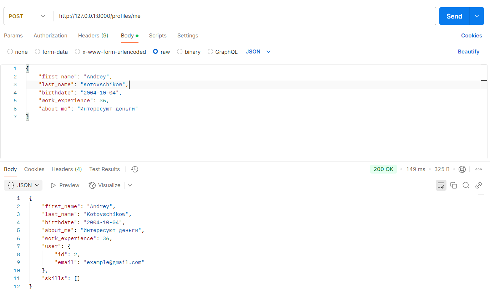
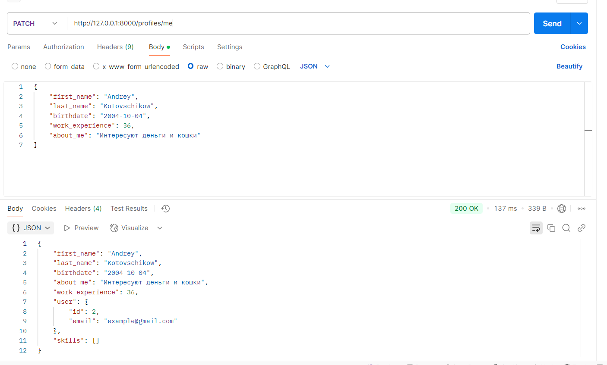
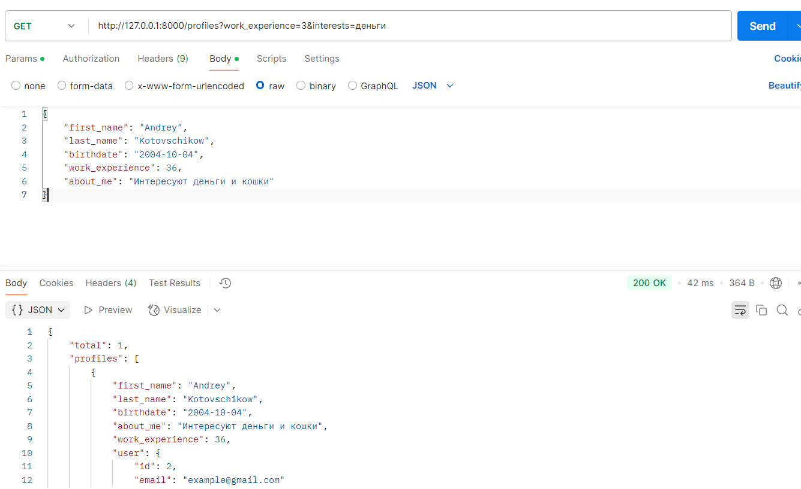
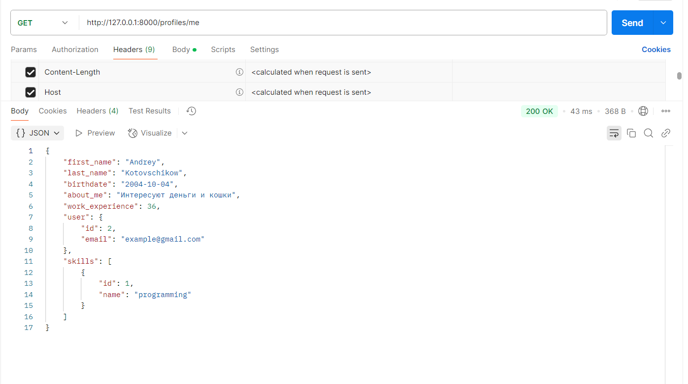
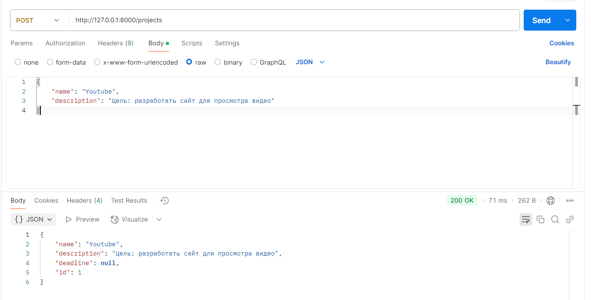
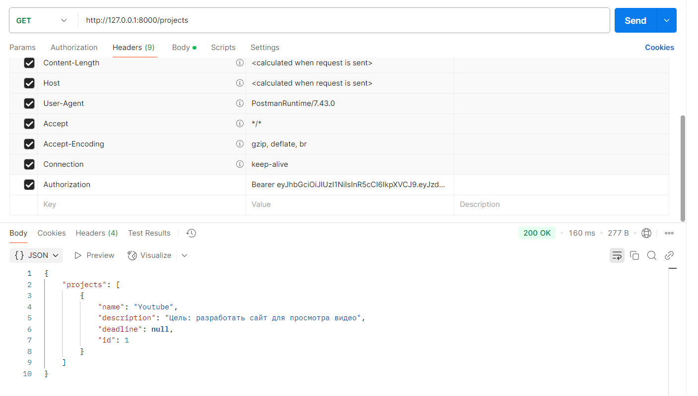

# Лабораторная работа 1. Реализация серверного приложения FastAPI

#### [Ссылка](https://github.com/KotovshchikovAndrey/ITMOWeb/tree/master/Lab1)

В качестве темы была выбрана разработка платформы для поиска людей в команду.

## Авторизация и аутентификация

Для авторизации и аутентификации пользователей в данной системе используются jwt токены, сгенерированные
с помощью библиотеки `PyJWT`. При регистрации пользователь указывает свой email и пароль, который будет захеширован
при помощи алгоритма `sha256` для того, чтобы при утечке данных из БД нельзя было его воспроизвести. В ответе клиент получит
jwt токен, который будет указывать в заголовке Authorization при обращении на другие эндпоинты.

```python
    ...

    async def sign_up(self, dto: UserCreateDTO) -> UserTokenDTO:
        stmt = exists().where(User.email == dto.email).select()
        is_exists = (await self._session.execute(stmt)).scalar()
        if is_exists:
            raise HTTPException(
                status_code=status.HTTP_409_CONFLICT,
                detail="Email occupied by another user",
            )

        new_user = User(
            email=dto.email,
            password=self._hash_password(dto.password),
        )

        self._session.add(new_user)
        await self._session.commit()
        await self._session.refresh(new_user)

        return UserTokenDTO(
            token=self._issue_token(new_user),
            user=UserDTO.model_validate(new_user),
        )
    
    ...
```

Метод sign_up принимает в себя объект DTO, проверяет что указанный email еще не занят, создает объект модели пользователя,
сохраняет ее в БД, генерирует jwt токен и возвращает ответ в виде объекта UserTokenDTO


Так как токен имеет ограниченное время жизни периодически клиенту необходимо заново авторизовываться
через эндпоинт `/sign-in`

```python
...

async def sign_in(self, dto: UserCreateDTO) -> UserTokenDTO:
        stmt = select(User).where(User.email == dto.email)
        user = (await self._session.execute(stmt)).scalar()
        if (user is None) or (self._hash_password(dto.password) != user.password):
            raise HTTPException(
                status_code=status.HTTP_401_UNAUTHORIZED,
                detail="Invalid email or password",
            )

        return UserTokenDTO(
            token=self._issue_token(user),
            user=UserDTO.model_validate(user),
        )

...
```

Для проверки корректности введенного пароля мы должны его захешировать и сравнить с тем, что лежит в
нашей базе данных


## Работа с профилями

После регистрации пользователю становится доступна опция создания профиля, в котором он
может указать информацию о себе, своих навыках, опыте работы и предпочтениях по проектам:


```python
...

 async def create_profile(self, me: UserDTO, dto: ProfileCreateDTO) -> ProfileDTO:
        stmt = exists().where(Profile.user_id == me.id).select()
        is_exists = (await self._session.execute(stmt)).scalar()
        if is_exists:
            raise HTTPException(
                status_code=status.HTTP_409_CONFLICT,
                detail="Profile has already been created",
            )

        new_profile = Profile(**dto.model_dump(), user_id=me.id)
        self._session.add(new_profile)
        await self._session.commit()
        await self._session.refresh(new_profile)

        return ProfileDTO.model_validate(new_profile)

...
```



Также имеется возможность обновить инофрмацию профили частично при помощи HTTP метода `PATCH`:

```python
async def update_profile(self, me: UserDTO, dto: ProfileUpdateDTO) -> ProfileDTO:
        stmt = select(Profile).where(Profile.user_id == me.id)
        profile = (await self._session.execute(stmt)).scalar()
        if profile is None:
            raise HTTPException(
                status_code=status.HTTP_404_NOT_FOUND,
                detail="Profile not found",
            )

        dict_dto = dto.model_dump(exclude_unset=True)
        for key, value in dict_dto.items():
            setattr(profile, key, value)

        self._session.add(profile)
        await self._session.commit()
        await self._session.refresh(profile)

        return ProfileDTO.model_validate(profile)
```




Доступна опция поиска профилей по навыкам, опыту и интересам:

```python
 async def search_profiles(self, dto: CriteriaDTO) -> ProfileListDTO:
        search_list = []
        if dto.work_experience:
            search_list.append(Profile.work_experience >= dto.work_experience)

        if dto.skills:
            search_list.append(
                select(ProfileSkill)
                .join(Skill, ProfileSkill.skill_id == Skill.id)
                .where(
                    Skill.name.in_(dto.skills),
                    ProfileSkill.profile_id == Profile.id,
                )
                .exists()
            )

        if dto.interests:
            search_list.append(
                or_(
                    *[
                        Profile.about_me.like(f"%{interest}%")
                        for interest in dto.interests
                    ]
                )
            )

        stmt = select(Profile).where(*search_list)
        profiles = (await self._session.execute(stmt)).scalars().all()
        return ProfileListDTO(
            total=len(profiles),
            profiles=[ProfileDTO.model_validate(profile) for profile in profiles],
        )
```




В любой момент пользователь может получить информацию о своем профиле через `GET /me`:

```python
 async def get_my_profile(self, me: UserDTO) -> ProfileDTO:
        stmt = (
            select(Profile)
            .where(Profile.user_id == me.id)
            .options(
                selectinload(Profile.skills),
                joinedload(Profile.user),
            )
        )

        profile = (await self._session.execute(stmt)).scalar()
        if profile is None:
            raise HTTPException(
                status_code=status.HTTP_404_NOT_FOUND,
                detail="Profile not found",
            )

        return ProfileDTO.model_validate(profile)
```




## Работа с проектами

Пользователь может создать проект и стать его владельцем (owner):

```python
 async def create_project(self, me: UserDTO, dto: ProjectCreateDTO) -> ProjectDTO:
    project = Project(**dto.model_dump(), owner_id=me.id)
    self._session.add(project)
    await self._session.commit()
    await self._session.refresh(project)

    return ProjectDTO.model_validate(project)
```





Пользователь может получить проекты, к которым он имеет доступ (является членом команды, имеющей доступ к проекту)
через `GET /profiles`

```python
 async def get_allowed_projects(
        self, me: UserDTO, limit: int, offset: Optional[int] = None
    ) -> list[ProjectDTO]:
        stmt = (
            select(Project)
            .join(Workflow, Workflow.project_id == Project.id)
            .where(
                Workflow.team_id.in_(
                    select(Member.team_id).where(Member.user_id == me.id).subquery()
                )
            )
            .limit(limit)
            .offset(offset or 0)
        )

        projects = (await self._session.execute(stmt)).scalars().unique()
        return [ProjectDTO.model_validate(project) for project in projects]
```





## Работа с командами

Если пользователь является членом команды он может посмотреть всех ее участников через
эндпоинт `GET /teams/{team_id}/members`


