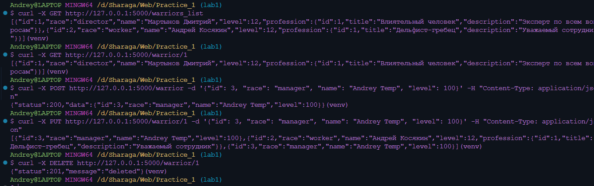
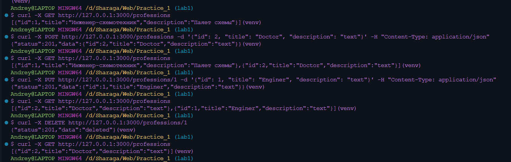

# Практика 1.1. Создание базового приложения на FastAPI

#### [Ссылка](https://)

## Создание вертуального окружения

```
python -m venv venv
source venv/Scripts/activate
```

## Утановка FastAPI

```
pip install fastapi[all]
```

## Тестовая БД

Для выполнения базовых CRUD операций была создана временная база данных в файле `main.py`:

```python
professions = [
    {
        "id": 1,
        "title": "Инженер-схемотехник",
        "description": "Паяет схемы",
    }
]

temp_bd = [
    {
        "id": 1,
        "race": "director",
        "name": "Мартынов Дмитрий",
        "level": 12,
        "profession": {
            "id": 1,
            "title": "Влиятельный человек",
            "description": "Эксперт по всем вопросам",
        },
        "skills": [
            {"id": 1, "name": "Купле-продажа компрессоров", "description": ""},
            {"id": 2, "name": "Оценка имущества", "description": ""},
        ],
    },
    {
        "id": 2,
        "race": "worker",
        "name": "Андрей Косякин",
        "level": 12,
        "profession": {
            "id": 1,
            "title": "Дельфист-гребец",
            "description": "Уважаемый сотрудник",
        },
        "skills": [],
    },
]
```

## Создание моделей

Для сериализации и десериализации данных были созданы **pydantic** модели. Они находятся в файле `models.py` и описывают структуру данных, хранящуюся в БД:

```python
class RaceType(Enum):
    director = "director"
    worker = "worker"
    junior = "junior"


class Profession(BaseModel):
    id: int
    title: str
    description: str


class Skill(BaseModel):
    id: int
    name: str
    description: str


class Warrior(BaseModel):
    id: int
    race: RaceType
    name: str
    level: int
    profession: Profession
    skills: Optional[List[Skill]] = []
```

## Создание API эндпоинтов воинов

Далее в рамках практической работы номер 1 были созданы api эндпоинты для
проведения базовых CRUD операций над войнами:

1 Получение списка воинов:

```python
@app.get("/warriors_list")
def warriors_list() -> List[Warrior]:
    return temp_bd
```

2 Получение конкретного воина по его уникальному идентификатору:

```python
@app.get("/warrior/{warrior_id}")
def warriors_get(warrior_id: int) -> List[Warrior]:
    return [warrior for warrior in temp_bd if warrior.get("id") == warrior_id]
```

3 Создание воина:

```python
@app.post("/warrior")
def warriors_create(warrior: Warrior):
    warrior_to_append = warrior.model_dump()
    temp_bd.append(warrior_to_append)
    return {"status": 200, "data": warrior}
```

4 Обновление воина:

```python
@app.put("/warrior/{warrior_id}")
def warrior_update(warrior_id: int, warrior: Warrior) -> List[Warrior]:
    for war in temp_bd:
        if war.get("id") == warrior_id:
            warrior_to_append = warrior.model_dump()
            temp_bd.remove(war)
            temp_bd.append(warrior_to_append)
    return temp_bd
```


5 Удаление воина:

```python
@app.delete("/warrior/{warrior_id}")
def warrior_delete(warrior_id: int):
    for i, warrior in enumerate(temp_bd):
        if warrior.get("id") == warrior_id:
            temp_bd.pop(i)
            break
    return {"status": 201, "message": "deleted"}
```

Корректность работы была проверена при помщи утилиты curl:



## Создание API эндпоинтов для профессий

Далее по заданию были реализованы аналогичные CRUD операции для профессий:

1 Получение списка профессий:

```python
@app.get("/professions")
def profession_list() -> List[Profession]:
    return professions
```

2 Создание профессии:

```python
@app.post("/professions")
def profession_create(profession: Profession):
    profession_dict = profession.model_dump()
    professions.append(profession_dict)
    return {"status": 201, "data": profession}
```

3 Полное обновление конкретной профессии по id:

```python
@app.put("/professions/{profession_id}")
def profession_update(profession_id: int, profession: Profession):
    for prof in professions:
        if prof.get("id") == profession_id:
            profession_dict = profession.model_dump()
            professions.remove(prof)
            professions.append(profession_dict)

    return {"status": 201, "data": profession}
```

4 Удаление профессии по id:

```python
@app.delete("/professions/{profession_id}")
def profession_delete(profession_id: int):
    for prof in professions:
        if prof.get("id") == profession_id:
            professions.remove(prof)
            break

    return {"status": 201, "data": "deleted"}
```

Результат:

