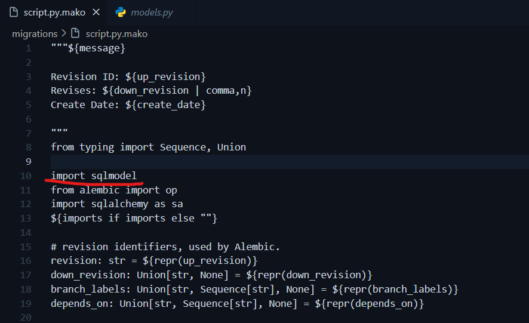
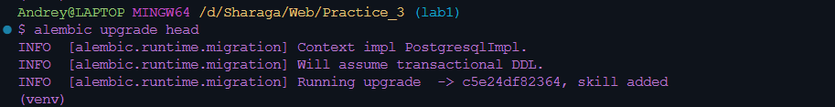

# Практика 1.3. Миграции, ENV, GitIgnore и структура проекта

#### [Ссылка](https://github.com/KotovshchikovAndrey/ITMOWeb/tree/master/Practice_3)

## Настройка миграций

Для удобного отслеживания изменений в таблицах базы данных с возможностью
добавления или удаления новых таблиц или колонок в них требуется систама миграций.

В текущей практической работе миграции были настроены при помощи библиотеки alembic. Сначала
ее необходимо установить используя пакетный менеджер `pip`:

```python
pip install alembic
```

Затем проинициализировать папку `migrations`, в которой будет хранится код запуска
миграций и сами миграции:

```python
alembic init migrations
```

Так как мы используем `sqlmodel` ее необходимо импортировать в шаблоне генерации миграций:



Далее в проект был внедрен файл .env, в котором указана переменная окружения DB_ADMIN, содержащая
строку подключения к базе данных. Это сделано для безопасности и сокрытия учетных записей от третьих лиц.

Получить переменную окружения нам поможет библиотека `python-dotenv`:

```python
pip install python-dotenv
```

В файле `env.py` в папке `migrations` были внесены слудующие изменения:

```python
from sqlmodel import SQLModel
from models import SkillWarriorLink, Skill, Warrior, Profession, WarriorProfessions

load_dotenv()

# this is the Alembic Config object, which provides
# access to the values within the .ini file in use.
config = context.config
if not config.get_main_option("sqlalchemy.url"):
    config.set_main_option("sqlalchemy.url", os.getenv("DB_ADMIN"))

# Interpret the config file for Python logging.
# This line sets up loggers basically.
if config.config_file_name is not None:
    fileConfig(config.config_file_name)

# add your model's MetaData object here
# for 'autogenerate' support
# from myapp import mymodel
# target_metadata = mymodel.Base.metadata
target_metadata = SQLModel.metadata
```

Здесь мы подгружаем переменные окружения из .env файла и устанавливаем параметр `sqlalchemy.url` в значение `DB_ADMIN`, тем
самым указывая адресс базы данных, для которой будут в последствии применены миграции.

В файле `connection.py` аналогично параметры для соединения с БД берутся из переменных окружения:

```python
import os
from dotenv import load_dotenv
from sqlmodel import SQLModel, Session, create_engine

load_dotenv()
db_url = os.getenv("DB_ADMIN")
engine = create_engine(db_url, echo=True)
```

Для проверки работоспособности миграций в модель `SkillWarriorLink` было
добавлено поле `level`. Затем создан файл с миграцими при помощи команды:

```
alembic revision --autogenerate -m "skill added"
```

В конце необходимо применяем миграции при помощи:

```
alembic upgrade head
```

Результат:




